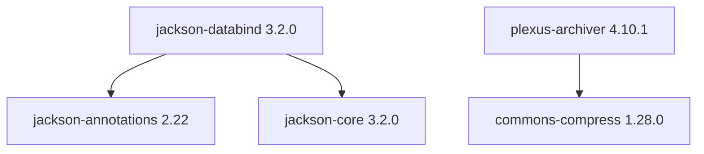

# sample-maven

Two direct dependencies; three target libraries arrive transitively:



| Target (transitive) | Version | Source |
| --- | --- | --- |
| `jackson-annotations` | 2.22 | [FasterXML/jackson-annotations](https://github.com/FasterXML/jackson-annotations) |
| `jackson-core` | 3.2.0 | [FasterXML/jackson-core](https://github.com/FasterXML/jackson-core) |
| `commons-compress` | 1.28.0 | [apache/commons-compress](https://github.com/apache/commons-compress) |

Any other transitives from `plexus-archiver` or `commons-compress` are included as Maven resolves them (no exclusions).

## Build & run

```bash
mvn -q -DskipTests package
mvn -q exec:java
```

## Dependency tree

```bash
mvn -q dependency:tree -Dscope=compile
```
